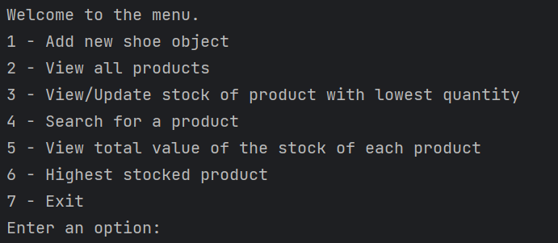

# finalCapstone
A project utilizing OOP to check the stock of a companies 'Shoes'

## Overview
The following program enables users to gain and manage information regarding a Shoe stock-taking list.
Utilising this program, store managers will be able to understand the amount of stock available per product and further information regarding each product.

## Installation
Open your terminal or command prompt.
### Initializing a repository:
1) Use 'cd' to change your directory then add/type your directory to initialize the directory of which you will place the local repository.
2) Use the command 'git init'
### Cloning the finalCapstone repository:
1) Enter 'git clone (https://github.com/JAdams-hub/finalCapstone)'

## Using the program
### Files:
Notice how there are two files for this program.
Inventory.txt contains the data regarding the stock of Shoe's in the organisations warehouse. The program utilizes this file to gain information of each Shoe Class.
Inventory.py is the program.

The file follows a specific order that allows the program to understand each line effectively. The heading at the top expresses the order of each type of data regarding the product.

### Menu:
The menu of this program provides the user 7 different courses of action that they can follow in regards of the program.

Utilizing this menu, the is able to perform exactly what the menu expresses. The user can for example add a new Shoe object, view all products and search for products etc.
When searching for a product the user must use the product code. 